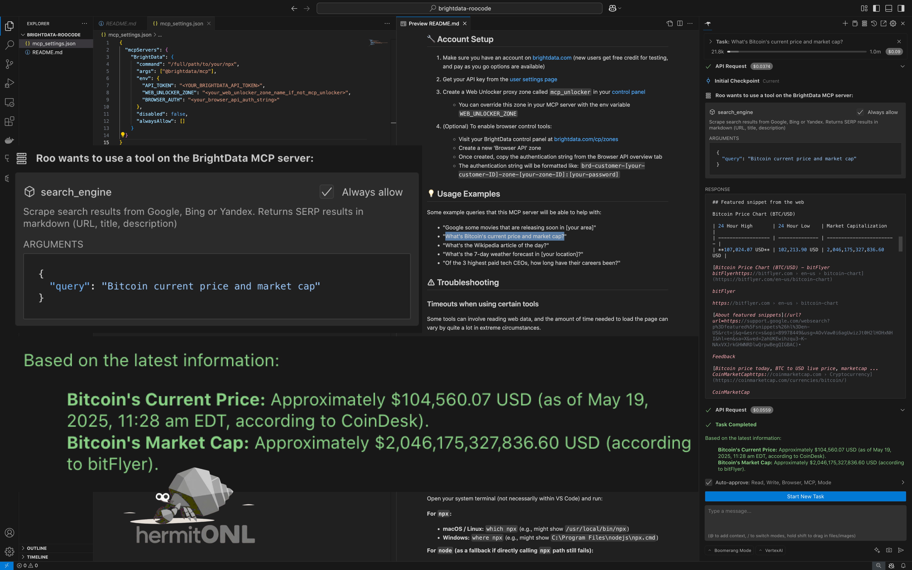

<h1 align="center">BrightData MCP for Roo Code</h1>
<h3 align="center">Enhance Roo Coding with Real-Time Web Data</h3>

## 🌟 Overview

Welcome to the official BrightData Model Context Protocol (MCP) server, designed to enhance **Roo Code** by enabling access, discovery, and extraction of real-time web data. This server allows Roo Code to seamlessly search the web, navigate websites, take action, and retrieve data—without getting blocked—perfect for scraping tasks.



## ✨ Features

- **Real-time Web Access**: Access up-to-date information directly from the web
- **Bypass Geo-restrictions**: Access content regardless of location constraints
- **Web Unlocker**: Navigate websites with bot detection protection
- **Browser Control**: Optional remote browser automation capabilities
- **Seamless Integration**: Designed for easy integration with Roo Code.

## 🚀 Quickstart with Roo Code

This guide explains how to integrate the BrightData MCP server with Roo Code, enabling powerful web access capabilities directly within your Roo environment.

**Key to Success**: Consistency in server naming and ensuring Roo Code's environment can find and execute the server command are crucial. Please follow the steps carefully.

### 1. Prerequisites

*   **Node.js and `npx`**: Ensure you have Node.js installed, which includes `npx` (Node Package Execute). If not, download and install it from the [official Node.js website](https://nodejs.org/en/download). This MCP server is run using `npx @brightdata/mcp`.
*   **Roo Code**: You need an active Roo Code environment.

### 2. BrightData Account Setup

Follow the detailed instructions in the [**� Account Setup**](#-account-setup) section of this README to:
    1.  Create or log in to your [BrightData account](https://brightdata.com/cp/zones/).
    2.  Obtain your **API Token**.
    3.  Set up a **Web Unlocker zone** (default name `mcp_unlocker`, or a custom name).
    4.  (Optional) Set up a **Browser API zone** and get the **authentication string** if you need browser control tools.

You will need these details for the Roo Code configuration.

### 3. Configure Roo Code

Roo Code manages MCP servers through a JSON configuration file.

1.  **Locate your Roo Code MCP settings file**:
    *   On **macOS**: `~/Library/Application Support/Code/User/globalStorage/rooveterinaryinc.roo-cline/settings/mcp_settings.json`
    *   On **Windows**: `%APPDATA%\Code\User\globalStorage\rooveterinaryinc.roo-cline\settings\mcp_settings.json`
    *   On **Linux**: `~/.config/Code/User/globalStorage/rooveterinaryinc.roo-cline/settings/mcp_settings.json`

    *Note: If the `rooveterinaryinc.roo-cline` part of the path is different in your setup, adjust accordingly. The key is to find the `mcp_settings.json` within your VS Code user storage for Roo.*

2.  **Edit `mcp_settings.json`**: Open the file and add the BrightData server configuration.
    *   **Server Name**: You will choose a name for this server configuration (e.g., `"BrightData"` or `"Bright Data"`). This name **must be used exactly** by Roo Code when it attempts to use the server's tools. We recommend `"BrightData"` (no space) for simplicity.
    *   **Command**: To avoid potential `PATH` issues within Roo Code's execution environment, it's highly recommended to use the **full path** to your `npx` executable. You can find this by running `which npx` (macOS/Linux) or `where npx` (Windows) in your terminal.

    If the `mcp_settings.json` file doesn't exist, or if the `mcpServers` object is empty, you can use the structure below. If it already contains other server configurations, add your BrightData server as a new key-value pair within the existing `mcpServers` object.

    ```json
    {
      "mcpServers": {
        "BrightData": { // Or "Bright Data" - choose one and be consistent!
          "command": "/full/path/to/your/npx", // E.g., "/usr/local/bin/npx" or "C:\\path\\to\\npx.cmd"
          "args": ["@brightdata/mcp"],
          "env": {
            "API_TOKEN": "<YOUR_BRIGHTDATA_API_TOKEN>", // Required
            // The following are optional. Remove the line if not using that feature.
            "WEB_UNLOCKER_ZONE": "<your_web_unlocker_zone_name_if_not_mcp_unlocker>", // Only if not 'mcp_unlocker'
            "BROWSER_AUTH": "<your_browser_api_auth_string>" // Only if using browser control tools
          },
          "disabled": false, // Must be false to enable the server
          "alwaysAllow": []  // Default to empty array
        }
        // Add other MCP servers here if you have them
      }
    }
    ```

3.  **Replace Placeholders & Configure**:
    *   Update `"command"` with the actual full path to your `npx` executable.
    *   Replace `<YOUR_BRIGHTDATA_API_TOKEN>` with your BrightData API token. This is **mandatory**.
    *   If your Web Unlocker zone is **not** named `mcp_unlocker`, set `WEB_UNLOCKER_ZONE` to its actual name. Otherwise, you can completely remove the `WEB_UNLOCKER_ZONE` line from the `env` object, and the server will default to `mcp_unlocker`.
    *   If you are **not** using browser control tools, you can completely remove the `BROWSER_AUTH` line from the `env` object. If you are, replace `<your_browser_api_auth_string>` with your actual auth string.

    **Crucial**:
    *   The server name used as the key (e.g., `"BrightData"`) in `mcpServers` is the exact name Roo Code must use to refer to this server.
    *   Ensure `disabled` is `false`.
    *   `alwaysAllow` should typically be `[]` unless you have specific reasons to bypass confirmation for certain tools.

### 4. Restart/Reload Roo Code

After saving the `mcp_settings.json` file, **it is highly recommended to fully restart VS Code.** This ensures that Roo Code and its MCP handling components re-initialize completely and pick up any changes to server commands or configurations. A simple reload of the window might not always be sufficient, especially if the server's startup `command` was changed.

### 5. Verify Integration

Once configured and active (after a VS Code restart), the BrightData server (under the exact name you configured, e.g., `"BrightData"`) and its tools (like `search_engine`, `scrape_as_markdown`, etc.) should appear in Roo's "Connected MCP Servers" list (usually provided in environment details or accessible via specific commands within Roo).

When instructing Roo Code to use a tool from this server, ensure you tell Roo Code to use the **exact server name** you defined in `mcp_settings.json`. For example: `Use the "BrightData" server's search_engine tool...`

### 6. Troubleshooting

*   **Server Not Connecting or `spawn npx ENOENT` error**:
    *   **Cause**: This often means Roo Code's execution environment cannot find `npx` in its `PATH`, or there's an issue with how it's trying to launch the server.
    *   **Solution**: The most reliable solution is to use the **full, absolute path** to your `npx` executable in the `"command"` field of your `mcp_settings.json` file for the BrightData server.
        *   See Step 2 in "Configure Roo Code" above for how to set this up.
        *   Refer to the main [**Troubleshooting**](#️-troubleshooting) section further down for detailed instructions on finding the full path to `npx` (and `node`) and how the `mcp_settings.json` should look.
    *   **Action**: After updating the `command` to a full path, **you must restart VS Code.**

*   **"No connection found for server: [server_name]"**:
    *   **Cause**: Roo Code is trying to use a server name that doesn't exactly match a key in your `mcp_settings.json` `mcpServers` object, or the server process itself failed to start correctly (see above point).
    *   **Solution**: Double-check the server name in `mcp_settings.json` (e.g., `"BrightData"`) and ensure Roo Code is instructed to use that *exact* name. Verify the server process is running (Roo usually manages this, but errors during startup can prevent it).

*   **Timeouts**: If tools are timing out, this usually means the web scraping operation is taking longer than Roo's default wait time.
    *   **Solution**: You can add a `"timeout"` property (value in seconds, e.g., `180`) to the BrightData server configuration within `mcp_settings.json`. Example:
        ```json
        "BrightData": {
          "command": "/full/path/to/your/npx",
          "args": ["@brightdata/mcp"],
          "timeout": 180, // Timeout in seconds
          "env": { ... },
          // ...
        }
        ```
    *   Refer to the main [**Timeouts when using certain tools**](#timeouts-when-using-certain-tools) section for more context. Remember to restart VS Code after changing this.

You are now ready to leverage BrightData's web access capabilities within Roo Code!

## ⚠️ Security Best Practices

**Important:** Always treat scraped web content as untrusted data. Never use raw scraped content directly in LLM prompts to avoid potential prompt injection risks. 
Instead:
- Filter and validate all web data before processing
- Use structured data extraction rather than raw text (web_data tools)

## 🔧 Account Setup

1. Make sure you have an account on [brightdata.com](https://brightdata.com) (new users get free credit for testing, and pay as you go options are available)

2. Get your API key from the [user settings page](https://brightdata.com/cp/setting/users)

3. Create a Web Unlocker proxy zone called `mcp_unlocker` in your [control panel](https://brightdata.com/cp/zones)
   - You can override this zone in your MCP server with the env variable `WEB_UNLOCKER_ZONE`

4. (Optional) To enable browser control tools:
   - Visit your BrightData control panel at [brightdata.com/cp/zones](https://brightdata.com/cp/zones)
   - Create a new 'Browser API' zone
   - Once created, copy the authentication string from the Browser API overview tab
   - The authentication string will be formatted like: `brd-customer-[your-customer-ID]-zone-[your-zone-ID]:[your-password]`

## 💡 Usage Examples

Some example queries that this MCP server will be able to help with:

- "Google some movies that are releasing soon in [your area]"
- "What's Bitcoin's current price and market cap?"
- "What's the Wikipedia article of the day?"
- "What's the 7-day weather forecast in [your location]?"
- "Of the 3 highest paid tech CEOs, how long have their careers been?"

## ⚠️ Troubleshooting
## 🤖 Advanced Use Case: AI-Powered LinkedIn Team Assembly

This section illustrates how an AI agent like Roo, equipped with BrightData MCP server tools, can automate a complex workflow: assembling a project team by discovering, extracting, and analyzing LinkedIn profiles. This process is typically guided by a detailed prompt, similar to this project's [`prompt.md`](prompt.md:1).

### Step 1: Candidate Discovery (Initial Search)
The AI agent initiates the process by searching for potential candidates.
*   It utilizes the `BrightData.search_engine` tool (e.g., with Google).
*   An example query could be: `site:linkedin.com/in/ "Target Company Name" "relevant keywords like job titles or skills"` to find publicly accessible LinkedIn profile URLs.

### Step 2: Detailed Profile Extraction
For each promising URL identified in the previous step, the agent extracts detailed information.
*   It uses the `BrightData.web_data_linkedin_person_profile` tool to retrieve structured data from individual LinkedIn profiles.

### Step 3: Data Management & Error Handling
The AI agent is instructed (via its main prompt or a guiding document like [`prompt.md`](prompt.md:1)) to manage the collected data and handle potential issues.
*   Successfully fetched profiles are stored, for instance, in a JSON file (e.g., [`gamuda_profiles.json`](gamuda_profiles.json:1)).
*   The agent gracefully handles errors during extraction (e.g., timeouts, private profiles, or CAPTCHAs). These errors are logged, and the agent proceeds with the remaining profiles.

### Step 4: AI-Driven Analysis and Team Assembly
With the structured profile data collected, the AI agent performs an analysis.
*   It compares the extracted skills, experience, and other relevant data points against a predefined list of project roles and their specific requirements.
*   Based on this analysis, the agent selects the most suitable candidates and proposes a project team.

### Step 5: Reporting
Finally, the AI agent generates a comprehensive report.
*   This report (e.g., a Markdown file like [`team_assembly_report.md`](team_assembly_report.md:1)) details the assembled team, provides justifications for each member's selection, and notes any roles that could not be filled or challenges encountered.

### Benefit
This advanced use case demonstrates how BrightData MCP tools, when orchestrated by a sophisticated AI agent like Roo, can effectively tackle complex, real-world data gathering, processing, and analytical tasks, transforming raw web data into actionable insights for strategic decision-making.

### Timeouts when using certain tools

Some tools can involve reading web data, and the amount of time needed to load the page can vary by quite a lot in extreme circumstances.

To ensure that your agent will be able to consume the data, set a high enough timeout in your agent settings.

A value of `180s` should be enough for 99% of requests, but some sites load slower than others, so tune this to your needs.

### spawn npx ENOENT

This error means that the system (specifically, the environment Roo Code is running in) cannot find the `npx` command in its `PATH`. While `npx` might work in your regular terminal, Roo Code's execution context can sometimes have a more restricted environment.

**The most robust solution is to provide the full, absolute path to the `npx` executable in your `mcp_settings.json` file.**

To fix it:

#### 1. Finding the Full Path to `npx` (and `node`)

Open your system terminal (not necessarily within VS Code) and run:

**For `npx`:**
*   **macOS / Linux:** `which npx` (e.g., might show `/usr/local/bin/npx`)
*   **Windows:** `where npx` (e.g., might show `C:\Program Files\nodejs\npx.cmd`)

**For `node` (as a fallback if directly calling `npx` path still fails):**
*   **macOS / Linux:** `which node` (e.g., `/usr/local/bin/node`)
*   **Windows:** `where node` (e.g., `C:\Program Files\nodejs\node.exe`)

Copy the full path shown for `npx`.

#### 2. Update your MCP Configuration in `mcp_settings.json`

In your `mcp_settings.json` file, modify the `command` for your BrightData server entry to use the full path to `npx` you just found.

**Example (macOS/Linux):**
If `which npx` gave you `/usr/local/bin/npx`, your config would look like:
```json
{
  "mcpServers": {
    "BrightData": { // Or whatever name you chose
      "command": "/usr/local/bin/npx", // Full path here
      "args": ["@brightdata/mcp"],
      "env": {
        "API_TOKEN": "YOUR_TOKEN",
        // ... other env vars
      },
      "disabled": false,
      "alwaysAllow": []
    }
  }
}
```

**Example (Windows):**
If `where npx` gave you `C:\Program Files\nodejs\npx.cmd`, your config would look like (note the escaped backslashes):
```json
{
  "mcpServers": {
    "BrightData": {
      "command": "C:\\Program Files\\nodejs\\npx.cmd", // Full path here
      "args": ["@brightdata/mcp"],
      "env": {
        "API_TOKEN": "YOUR_TOKEN",
        // ... other env vars
      },
      "disabled": false,
      "alwaysAllow": []
    }
  }
}
```

**Alternative (if direct `npx` path fails): Using full `node` path to run `npx`**
If using the direct path to `npx` still causes issues, you can try using the full path to `node` to execute the `npx` script. This is less common but can be a fallback.
Find the `npx` script location (it's usually alongside `node` but in a `bin` or `node_modules/.bin` relative to the global npm install). For a globally installed `npx`, it's often simpler to just use the direct `npx` path. If `npx` was installed locally to a project, the path would be like `node_modules/.bin/npx`. However, for MCP servers, global paths are typical.

The primary recommendation is to use the direct, full path to the `npx` executable itself.

#### 3. Restart VS Code

After saving changes to `mcp_settings.json`, **you MUST fully restart VS Code** for the new command path to be used by Roo Code when it starts the MCP server.

## 🔧 List of Available Tools

|Feature|Description|
|---|---|
|search_engine|Scrape search results from Google, Bing or Yandex. Returns SERP results in markdown (URL, title, description)|
|scrape_as_markdown|Scrape a single webpage URL with advanced options for content extraction and get back the results in MarkDown language. This tool can unlock any webpage even if it uses bot detection or CAPTCHA.|
|scrape_as_html|Scrape a single webpage URL with advanced options for content extraction and get back the results in HTML. This tool can unlock any webpage even if it uses bot detection or CAPTCHA.|
|session_stats|Tell the user about the tool usage during this session|
|web_data_amazon_product|Quickly read structured amazon product data. Requires a valid product URL with /dp/ in it. This can be a cache lookup, so it can be more reliable than scraping|
|web_data_amazon_product_reviews|Quickly read structured amazon product review data. Requires a valid product URL with /dp/ in it. This can be a cache lookup, so it can be more reliable than scraping|
|web_data_linkedin_person_profile|Quickly read structured linkedin people profile data. This can be a cache lookup, so it can be more reliable than scraping|
|web_data_linkedin_company_profile|Quickly read structured linkedin company profile data. This can be a cache lookup, so it can be more reliable than scraping|
|web_data_zoominfo_company_profile|Quickly read structured ZoomInfo company profile data. Requires a valid ZoomInfo company URL. This can be a cache lookup, so it can be more reliable than scraping|
|web_data_instagram_profiles|Quickly read structured Instagram profile data. Requires a valid Instagram URL. This can be a cache lookup, so it can be more reliable than scraping|
|web_data_instagram_posts|Quickly read structured Instagram post data. Requires a valid Instagram URL. This can be a cache lookup, so it can be more reliable than scraping|
|web_data_instagram_reels|Quickly read structured Instagram reel data. Requires a valid Instagram URL. This can be a cache lookup, so it can be more reliable than scraping|
|web_data_instagram_comments|Quickly read structured Instagram comments data. Requires a valid Instagram URL. This can be a cache lookup, so it can be more reliable than scraping|
|web_data_facebook_posts|Quickly read structured Facebook post data. Requires a valid Facebook post URL. This can be a cache lookup, so it can be more reliable than scraping|
|web_data_facebook_marketplace_listings|Quickly read structured Facebook marketplace listing data. Requires a valid Facebook marketplace listing URL. This can be a cache lookup, so it can be more reliable than scraping|
|web_data_facebook_company_reviews|Quickly read structured Facebook company reviews data. Requires a valid Facebook company URL and number of reviews. This can be a cache lookup, so it can be more reliable than scraping|
|web_data_x_posts|Quickly read structured X post data. Requires a valid X post URL. This can be a cache lookup, so it can be more reliable than scraping|
|web_data_zillow_properties_listing|Quickly read structured zillow properties listing data. Requires a valid zillow properties listing URL. This can be a cache lookup, so it can be more reliable than scraping|
|web_data_booking_hotel_listings|Quickly read structured booking hotel listings data. Requires a valid booking hotel listing URL. This can be a cache lookup, so it can be more reliable than scraping|
|web_data_youtube_videos|Quickly read structured YouTube videos data. Requires a valid YouTube video URL. This can be a cache lookup, so it can be more reliable than scraping|
|scraping_browser_navigate|Navigate a scraping browser session to a new URL|
|scraping_browser_go_back|Go back to the previous page|
|scraping_browser_go_forward|Go forward to the next page|
|scraping_browser_click|Click on an element. Avoid calling this unless you know the element selector (you can use other tools to find those)|
|scraping_browser_links|Get all links on the current page, text and selectors. It's strongly recommended that you call the links tool to check that your click target is valid|
|scraping_browser_type|Type text into an element|
|scraping_browser_wait_for|Wait for an element to be visible on the page|
|scraping_browser_screenshot|Take a screenshot of the current page|
|scraping_browser_get_html|Get the HTML content of the current page. Avoid using the full_page option unless it is important to see things like script tags since this can be large|
|scraping_browser_get_text|Get the text content of the current page|